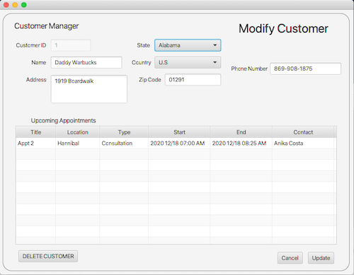
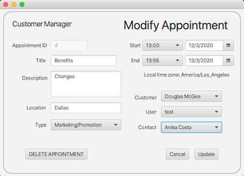
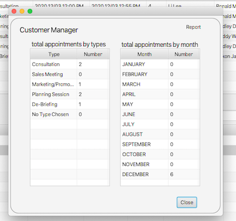

 
# CustomerPlus
This application is a WGU Java project that allows users to organize customers,
salespeople, and appointments between them. The database is network-based and is 
hoseted by a MySQL database and accessed through the MYSQLJDBC Driver. There is
multi-language functionality that is implemented via Lang resource bundles. This
project also shows effective use of time zones, enums/fixed menus, and MVC + DAO 
structure.

## User Interface
After a simple login page ("admin", "admin") the user is brought to a main screen
which brings together customers and appointments in two tables. 

From there the user can easily navigate between customers (adding, modifying, 
deleting), appointments (adding, modifying, deleting), and contacts.

 

Lastly, there are a number of reports that are automatically created within a drop-
down menu. Of course, there are an unlimited amount of ways to utilize data to
visualize business intelligence but here I show the ability to perform a few.

